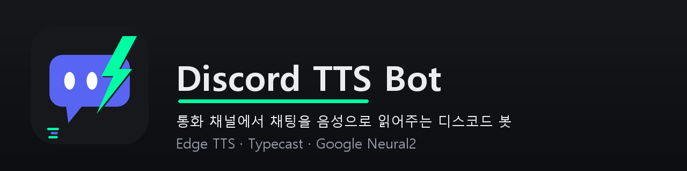

<p align="center">
  
</p>

# Discord TTS Bot

봇 전용 채널에 친 채팅을 TTS로 읽어 통화 채널에서 재생해주는 디스코드 봇입니다.

## 기능

- 서버 초대 시 봇 전용 텍스트 채널(`tts봇`) 자동 개설
- 통화 채널에 있는 유저가 `!시작` 을 입력하면 그 통화 채널에 봇이 입장
- 전용 채널의 채팅을 TTS로 읽어 통화 채널에서 재생 (재생 큐로 순서 보장)
- **봇은 시작한 유저에게 귀속** — 다른 유저의 채팅은 무시
- TTS 엔진 3종 지원:
  - **Edge TTS** — 무료, 기본 엔진 (선히/인준/현수)
  - **Typecast** — 한국어 음성 26종, 감정(기쁨/슬픔/화남/속삭임 등) 지원, 무료 플랜 월 30,000 크레딧
  - **Google Cloud TTS (Neural2)** — 한국어 3종, 월 무료 한도(100만 자)의 95%까지만 사용하고 초과 시 Edge TTS로 자동 전환되는 과금 방지 장치 내장
- 재생 속도(0.5~2.0배속), 감정, 목소리를 명령어로 변경 (랜덤 선택 지원)
- 유저별 마지막 목소리·속도·감정 설정을 기억했다가 다음 시작 때 자동 복원
- 크레딧/무료 한도 사용량 조회
- 봇 주인이 통화 채널에서 나가면 자동 종료
- Windows GUI 컨트롤 패널 (실행/종료/재시작, 로그 뷰어, 트레이 최소화)

## 명령어

봇 전용 채널(`tts봇`)에서 사용합니다.

| 명령어 | 설명 |
|---|---|
| `!시작 [봇이름] [랜덤]` | 내가 접속한 통화 채널에 봇 입장, TTS 시작. 봇이 여러 개면 이름 지정, `랜덤` 을 붙이면 랜덤 목소리로 시작 |
| `!종료` | TTS 종료 (시작한 유저만) |
| `!목소리 <이름\|랜덤>` | 목소리 변경, `랜덤` 입력 시 무작위 선택 (시작한 유저만) |
| `!목소리목록` | 사용 가능한 목소리 목록 (엔진·성별 표시) |
| `!속도 <0.5~2>` | 재생 속도 변경, 인자 없이 입력하면 현재 속도 확인 |
| `!감정 <이름>` | Typecast 목소리 감정 변경 — 기본/기쁨/슬픔/화남/속삭임/톤업/톤다운 |
| `!크레딧` | Typecast 크레딧·Google 무료 한도 사용량 조회 |
| `!채널생성` | 봇 전용 채널이 없을 때 다시 생성 |
| `!도움말` | 명령어 안내 |

## 사전 준비

### 1. 디스코드 봇 생성

1. [Discord 개발자 포털](https://discord.com/developers/applications)에서 **New Application** 생성
2. **Bot** 탭에서:
   - **Reset Token** 으로 토큰 발급 → `.env` 에 저장
   - **Privileged Gateway Intents** 에서 **MESSAGE CONTENT INTENT** 활성화 (필수!)
   - 아바타 이미지로 `icon/icon.png` 업로드 (선택)
3. **OAuth2 → URL Generator** 에서 초대 링크 생성:
   - Scopes: `bot`
   - Bot Permissions: `Manage Channels`, `View Channels`, `Send Messages`, `Connect`, `Speak`
   - 생성된 URL로 봇을 서버에 초대

### 2. FFmpeg 설치 (음성 재생에 필수)

```powershell
winget install Gyan.FFmpeg
```

### 3. 설치 (GUI로 진행)

```powershell
git clone git@github.com:GankWaL/discord_bot_chzzk_tts.git
cd discord_bot_chzzk_tts
bat\setup.bat
```

`bat\setup.bat` 을 실행하면 컨트롤 패널이 뜨고, 아래 순서로 클릭하면 설치가 끝납니다:

1. **설정 창** (자동으로 열림) — 디스코드 봇 토큰과 API 키 입력 → `.env` 자동 생성
2. **[환경 설치]** — requirements.txt 라이브러리 일괄 설치
3. **[exe 재빌드]** — 빌드 환경 자동 구성 후 exe 생성 → 이후부터는 `bat\start_gui.bat` 이 exe로 실행됨 (기본)

패치는 **[업데이트 확인]** 버튼으로 처리됩니다 — 깃허브에 새 커밋이 있으면 목록을 보여주고, 확인하면 자동으로 `git pull` + exe 재빌드까지 진행합니다. 코드를 직접 수정한 경우에는 **[exe 재빌드]** 버튼만 누르면 됩니다.

### .env 키 설명

GUI 설정 창에서 입력하는 값들입니다 (`.env` 직접 편집도 가능):

| 변수 | 필수 | 설명 |
|---|---|---|
| `DISCORD_TOKEN` | ✅ | 디스코드 봇 토큰 |
| `TYPECAST_API_KEY` | 선택 | [Typecast 콘솔](https://studio.typecast.ai/developers)에서 발급. 설정 시 Typecast 목소리 활성화 |
| `GOOGLE_TTS_API_KEY` | 선택 | [Google Cloud Console](https://console.cloud.google.com)에서 Cloud Text-to-Speech API 활성화 후 발급. 설정 시 구글 목소리 활성화 |

## 실행

| 방법 | 파일 | 설명 |
|---|---|---|
| **GUI (권장)** | `bat\start_gui.bat` | 컨트롤 패널 실행 (exe가 있으면 exe, 없으면 소스로) |
| 헤드리스 | `bat\start_bot.bat` / `bat\start_bot_hidden.vbs` | 봇만 실행 (vbs는 창 없이) |
| exe 직접 | `dist\tts_bot_gui.exe` | 컨트롤 패널 exe 직접 실행 |
| 소스 직접 | `python src\bot.py` | 터미널에서 직접 |

**PC 시작 시 자동 실행**: 시작 프로그램 폴더(`shell:startup`)에 `bat\start_gui_hidden.vbs` 바로가기를 넣으면 로그온 시 GUI가 뜨면서 봇이 자동 시작됩니다.

## 컨트롤 패널 (GUI)

- **실행 / 종료 / 재시작** 버튼과 봇 상태 표시 (외부에서 실행된 봇도 감지·제어)
- **설정** — 토큰/API 키 입력 서브 창 (.env 자동 생성·수정)
- **환경 설치** — requirements.txt 라이브러리 일괄 설치
- **exe 재빌드** — 빌드 환경 자동 구성 후 exe 재빌드
- **업데이트 확인** — 깃허브 새 커밋 확인 → 승인 시 git pull + 자동 재빌드
- 봇 로그(bot.log) 실시간 확인
- 창을 닫으면 종료되지 않고 **트레이로 최소화** — 트레이 아이콘 우클릭 → 창 열기 / 봇 재시작 / 컨트롤 패널 종료(봇 유지) / 완전 종료(봇도 종료)

## 구조

```
├── src\
│   ├── bot.py          # 봇 본체 (명령어, 세션 관리, 재생 큐)
│   ├── tts.py          # TTS 엔진 모듈 (Edge / Typecast / Google)
│   └── bot_gui.py      # 컨트롤 패널 GUI
├── icon\               # 아이콘·배너 이미지
├── dist\               # exe 빌드 결과물 (커밋 제외)
├── bat\
│   ├── setup.bat             # 최초 설치용 (GUI 실행)
│   ├── start_gui.bat         # 컨트롤 패널 실행
│   ├── start_gui_hidden.vbs  # 시작 프로그램용 (봇 자동 시작 포함)
│   ├── start_bot.bat         # 봇 헤드리스 실행
│   └── start_bot_hidden.vbs
└── requirements.txt
```

## 내 목소리 (커스텀 TTS) — v0.0.2

자기 목소리를 녹음해 그 목소리로 채팅을 읽게 할 수 있습니다 (Qwen3-TTS 제로샷 클로닝).

1. **녹음**: GUI → [내 목소리 만들기] → 스크립트 30문장을 마이크로 녹음 (데이터셋: `my_voice\<이름>\`)
2. **추론 환경 구성** (최초 1회, 수 GB 다운로드):
   ```powershell
   python -m venv tts_env
   tts_env\Scripts\python -m pip install torch --index-url https://download.pytorch.org/whl/cu121
   tts_env\Scripts\python -m pip install qwen-tts
   ```
3. **서버 실행**: GUI → [커스텀 TTS 서버] 버튼 (또는 `bat\start_tts_server.bat`) — 모델 로딩까지 수십 초
4. **사용**: 봇 전용 채널에서 `!목소리 <녹음한 이름>` — `!목소리목록` 에 "커스텀 TTS" 로 표시됩니다

- 첫 합성 시 참조 음성으로 클로닝 프롬프트를 만들어 이후 재사용합니다 (첫 문장만 느림)
- NVIDIA GPU(8GB VRAM 권장)에서 동작하며, GPU가 없으면 CPU로도 되지만 느립니다
- 커스텀 목소리는 아직 속도/감정 조절이 적용되지 않습니다

### 파인튜닝으로 품질 올리기 (Google Colab, 무료)

제로샷보다 더 닮은 목소리를 원하면 Colab에서 파인튜닝할 수 있습니다 (로컬 GPU 불필요):

1. 녹음 스튜디오에서 **[학습 패키지 내보내기 (Colab용)]** → `my_voice_export\` 에 zip + 노트북 생성
2. [Google Colab](https://colab.research.google.com)에 노트북(.ipynb) 업로드 → **런타임 → 모두 실행** → 안내에 따라 zip 업로드 (약 20~40분)
3. 학습 완료 후 자동 다운로드되는 `<이름>_model_package.zip` 을 **[학습된 모델 가져오기]** 로 등록
4. 커스텀 TTS 서버 재시작 → 그 목소리는 이제 학습된 모델로 합성됨 (`!목소리목록` 에 "학습됨" 표시)

- 모델 패키지 zip 은 다른 사람에게 공유 가능 — 받은 사람도 [학습된 모델 가져오기] 로 등록하면 같은 목소리를 쓸 수 있습니다
- 무료 Colab(T4)은 0.6B 모델 기준이며, Colab Pro(A100)라면 노트북 상단에서 1.7B 로 변경 가능합니다

## 빌드 (exe)

```powershell
python -m venv build_env
build_env\Scripts\python -m pip install -r requirements.txt pyinstaller
build_env\Scripts\python -m PyInstaller --noconfirm --onefile --icon icon\icon.ico --name tts_bot --collect-all nacl --collect-all davey --hidden-import _cffi_backend src\bot.py
build_env\Scripts\python -m PyInstaller --noconfirm --onefile --windowed --icon icon\icon.ico --name tts_bot_gui src\bot_gui.py
```

빌드 후 `dist\` 에 `.env` 와 `icon\` 폴더를 복사하면 폴더째 배포할 수 있습니다. (실행 PC에 FFmpeg 필요)
